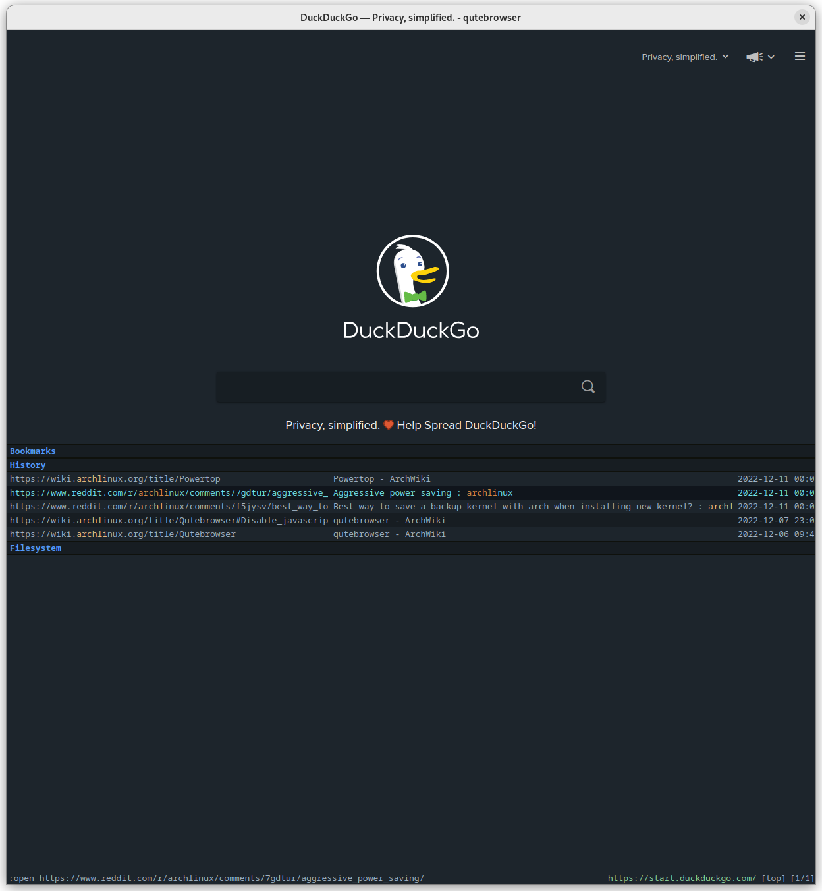

# Qutebrowser City Lights

> A matte dark theme for [Qutebrowser](https://www.qutebrowser.org/index.html).



Freely inspired from [City Lights Color Theme](http://citylights.xyz/).

## Install
You could dump the content of `city-lights-theme.py` in your `config.py` file with a copy-paste move and, as a matter of fact, it would be effective enough; but there are tidier ways to install a qutebrowser theme. I will show mine here.

First of all, make a `themes` directory in your dot qutebrowser one. 
Let's say you keep your `config.py` in `~/.config/qutebrowser`:

``` sh
mkdir ~/.config/qutebrowser/themes
```

Then, clone this repo in the freshly baked themes directory.

``` sh
git clone https://github.com/gicrisf/qute-city-lights.git ~/.config/qutebrowser/themes/qute-city-lights
```

Finally, add this line in your config file:

``` python
# config.py

config.source('themes/qute-city-lights/city-lights-theme.py')
```

> N.B. Make sure you don't mess up with colors after importing it (e.g. by leaving another theme import after this command).

Start Qutebrowser and enjoy your new dark theme.

## Support
Why don't you help me keeping myself awake buying me a coffee?
I can take care of projects like this one in the extra time!

[](https://ko-fi.com/V7V425BFU)

<a href="https://liberapay.com/gicrisf/donate"></a>

## License
[MIT](https://github.com/gicrisf/qute-city-lights/blob/main/LICENSE)
